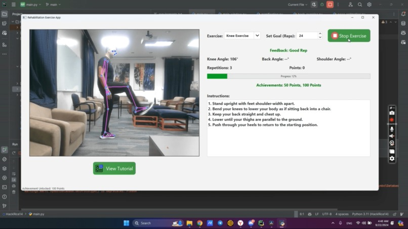
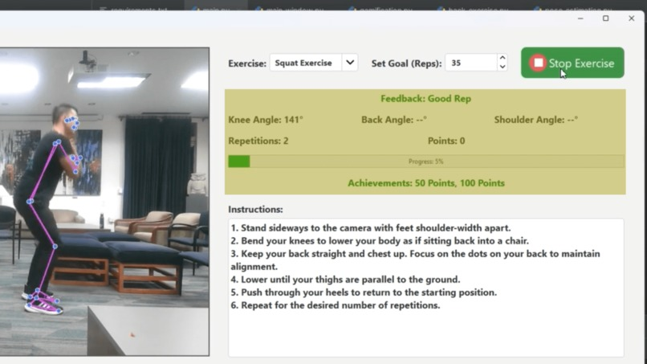

# HackRice14 RecoveryIO

**HackRice14 RecoveryIO (RestoreIO)** is a Python-based, AI-powered rehabilitation application that focuses on helping users recover from knee and other joint injuries. It leverages motion tracking via webcam and provides real-time feedback to ensure users are performing exercises correctly. The app tracks progress, includes gamification elements, and offers various exercises for users to complete as part of their rehabilitation journey.




## Inspiration

RestoreIO was created in response to the demand for an intelligent, customized solution to accelerate healing following an accident or knee replacement surgery. To reduce stiffness in the newly repaired knee, patients typically need to perform daily exercises under the guidance of a physician. However, this procedure can be costly and time-consuming. Our goal was to develop an app that enables patients to monitor their recovery and receive real-time feedback on their form, eliminating the need for ongoing medical supervision.

## What It Does

RestoreIO tracks patients' progress and analyzes their form in real-time during recovery exercises using computer vision. By assisting users in maintaining proper posture throughout rehabilitation activities, it reduces the risk of re-injury or delayed recovery. The software aids in knee replacement recovery by offering tailored workout modifications based on user performance.

## How We Built It

We built RestoreIO as a client-side application with a complete and user-friendly graphical interface using Python in PyCharm. The application incorporates libraries for motion tracking and body movement analysis, such as:
- **MediaPipe** (from Google) for pose tracking and motion analysis
- **NumPy** for data manipulation
- **OpenCV** for video processing
- **PyQt5** for the graphical interface

This combination allows RestoreIO to provide comprehensive feedback on recovery activities and make form-based improvement suggestions effectively.

## Getting Started

### Prerequisites

Make sure you have the following installed on your system:

- Python 3.8 or higher
- OpenCV
- TensorFlow or PyTorch (for AI model handling)
- Other dependencies listed in `requirements.txt`

### Installation

1. Clone the repository to your local machine:

    ```bash
    git clone https://github.com/OfficialCodeVoyage/HackRice14_RecoveryIO.git
    ```

2. Navigate to the project directory:

    ```bash
    cd HackRice14_RecoveryIO
    ```

3. Create a virtual environment (optional but recommended):

    ```bash
    python3 -m venv venv
    source venv/bin/activate  # On Windows, use `venv\Scripts\activate`
    ```

4. Install the required dependencies:

    ```bash
    pip install -r requirements.txt
    ```

### Running the Application

1. Start the application by running the `main.py` file:

    ```bash
    python main.py
    ```

2. The GUI will launch, allowing you to select exercises and begin your rehabilitation program.

### Testing Webcam Functionality

Ensure your webcam is connected and test the motion tracking by running:

```bash
python test_webcam.py
```

Project Structure

```plaintext
HackRice14_RecoveryIO/
│
├── assets/               # Media assets (images, videos, etc.)
├── gui/                  # GUI-related code and layout
├── modules/              # Exercise modules (e.g., knee, back exercises)
├── tutorials/            # Documentation and instructional material
├── utils/                # Utility functions
├── .gitignore            # Git ignore rules
├── README.md             # Project documentation
├── __init__.py           # Package marker
├── app.log               # Log file for application errors or events
├── main.py               # Main entry point for the application
├── progress.db           # Local database for tracking progress
├── requirements.txt      # Dependencies list
├── test_webcam.py        # Script for testing webcam and motion tracking
└── view_progress.py      # View progress and stats over time
```

## Exercises Supported

Currently, the following exercises are supported:

- Knee Bends
- Squats
- Leg Raises
- Back Stretches

Future exercises for other body parts (e.g., shoulder, ankle) will be added in upcoming versions.

## Progress Tracking

User progress is saved in `progress.db`, a SQLite database. You can track your completed exercises, points, and rewards via the app’s built-in visualization features.

## Built With

- **AI**
- **Computer Vision**
- **MediaPipe**
- **OpenCV**
- **Python**
- **PyQt5**
- **Red Bulls** (for keeping us awake!)

## Contributing

We welcome contributions! If you would like to add new features, fix bugs, or suggest improvements, please follow these steps:

1. Fork the repository
2. Create a new branch (`git checkout -b feature-name`)
3. Make your changes and commit (`git commit -am 'Add new feature'`)
4. Push to the branch (`git push origin feature-name`)
5. Submit a pull request

## License

This project is licensed under the MIT License - see the [LICENSE](LICENSE) file for details.

## Acknowledgements

- **HackRice14** for hosting the hackathon that inspired this project. - https://www.hackrice.com/
- **OpenAI**, **TensorFlow**, **OpenCV** for the core technologies that power the motion tracking and AI feedback.


